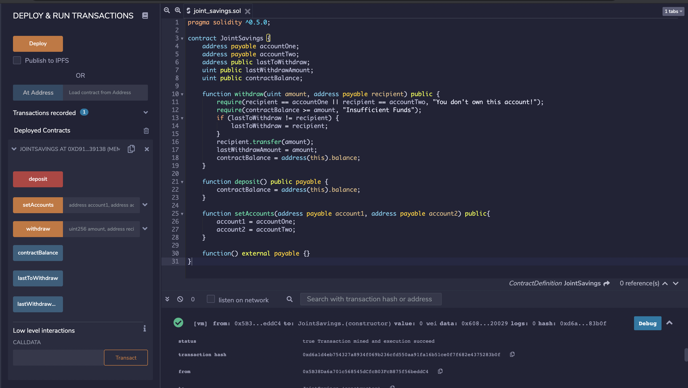
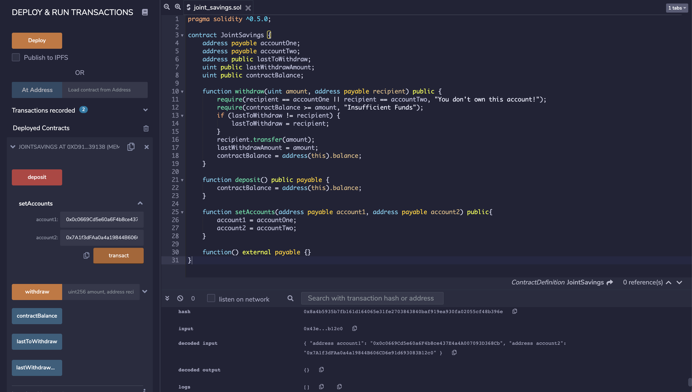
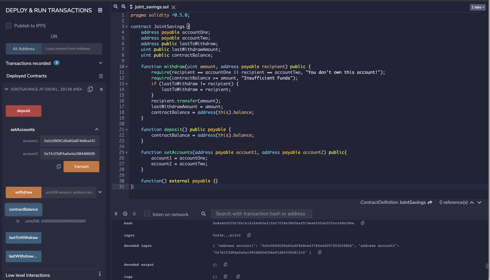
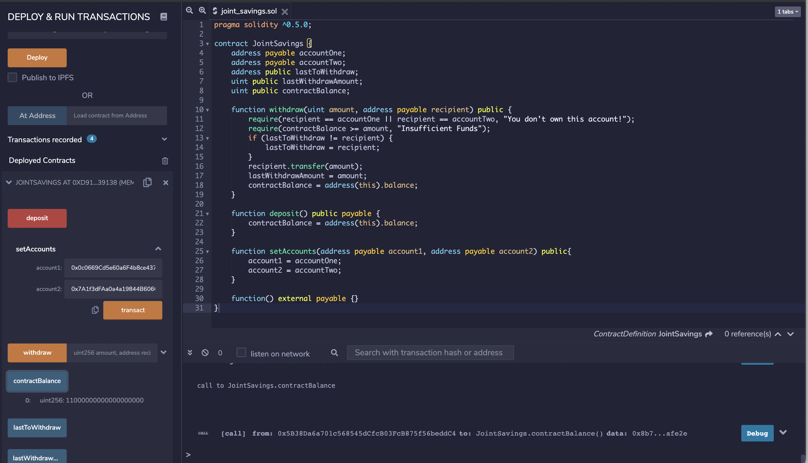
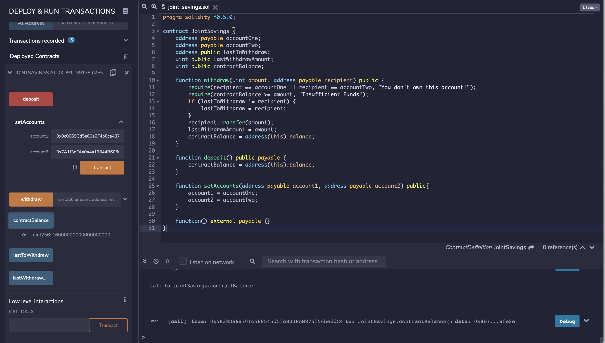
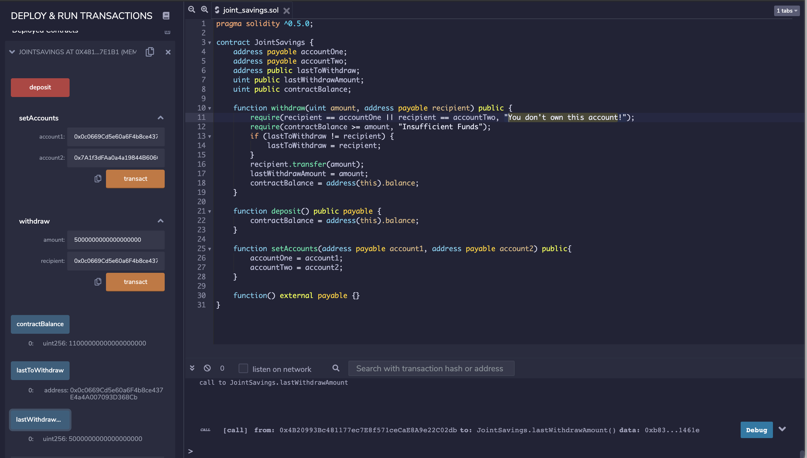
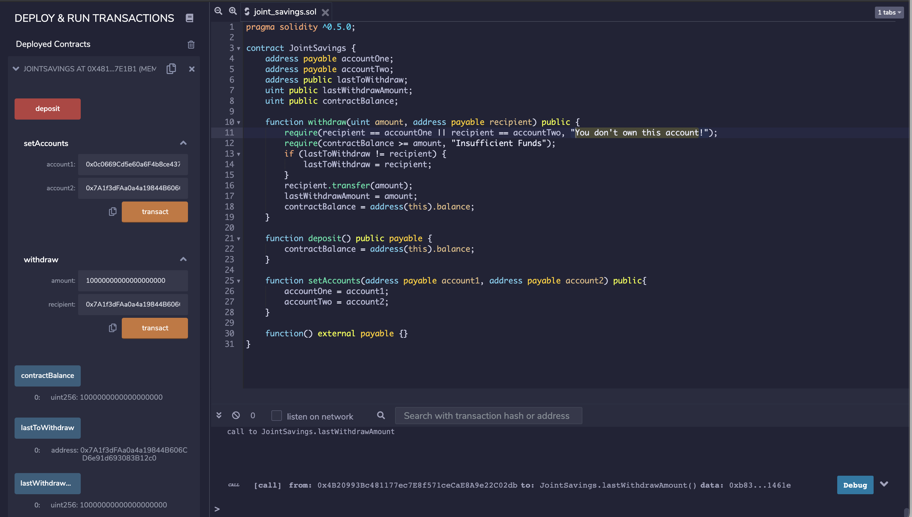
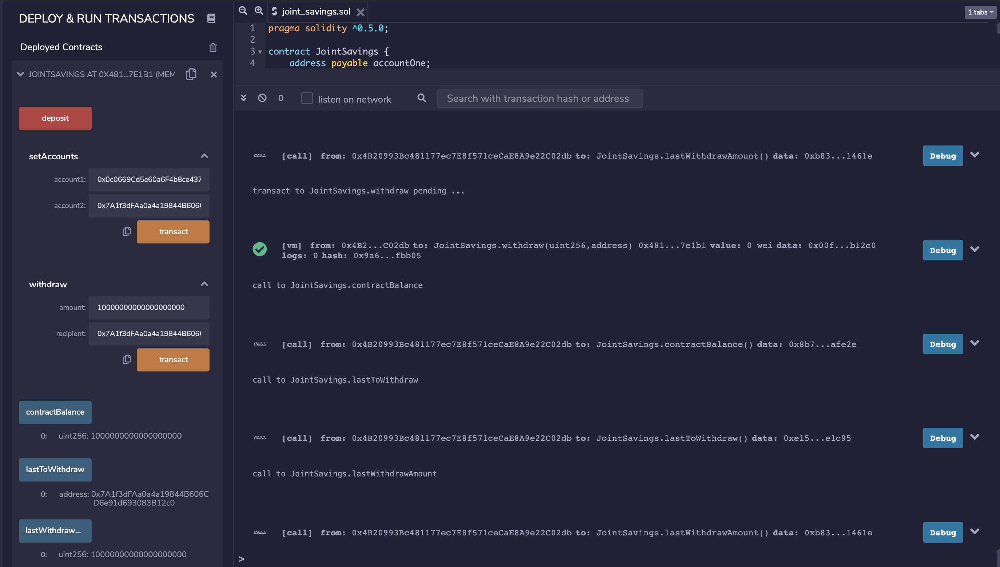

### Ethereum Smart Contract
A smart contract running on the ethereum blockchain that allows two users to automatically create a joint savings account. 

**Overview of the project and project goals**

This application will automate the creation of joint savings accounts using a Solidity smart contract that accepts two user addresses. These addresses will be able to control a joint savings account. The smart contract uses ethereum management functions to implement a financial institution’s requirements for providing the features of the joint savings account. These features currently consist of the ability to deposit and withdraw funds from the account.

## Installation

1. Clone repo from GitHub to your computer:

```
git clone https://github.com/JonahLeggett/Ethereum_Smart_Contract.git
```

## Run Remix IDE

To run this smart contract, you can use the Remix IDE. For this purpose, you can use the web version Remix IDE, and you won’t need to install any software.

* [Remix IDE](https://remix.ethereum.org/)

## Instructions (With Screenshots) for using the Smart Contract in Remix IDE

Complete the following steps:

1. Open File in Remix IDE

- From repository, open the Solidity file named joint_savings.sol in the Remix IDE.

2. Compile the Contract in the JavaScript VM

- On left pane, select the 'Solidity Compiler' tab, and from the "Compiler" drop down menu select "0.5.0"

- Click "Compile" in the Remix IDE to compile the smart contract. 

3. Deploy the Contract in the JavaScript VM

- In the Remix IDE, navigate to the “Deploy & Run Transactions” pane, and then make sure that “JavaScript VM” is selected as the environment.



- Click the Deploy button to deploy your smart contract, and then confirm that it successfully deployed.

3. Interact with the Deployed Smart Contract

- Use the setAccounts function to define the authorized Ethereum address that will be able to withdraw funds from the contract.



- Test the "deposit" functionality of the smart contract by sending ether. 





- Test the "withdrawal" functionality of the smart contract. 




- Validate transactions with the "lastToWithdraw" and "lastWithdrawAmount" functions. 



## License

MIT